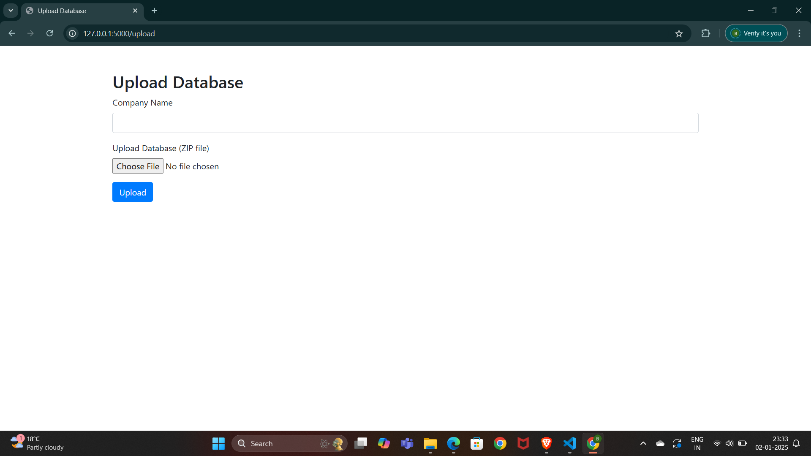
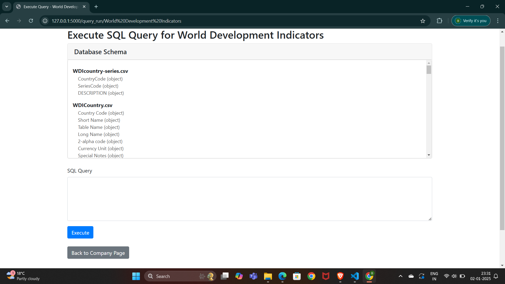
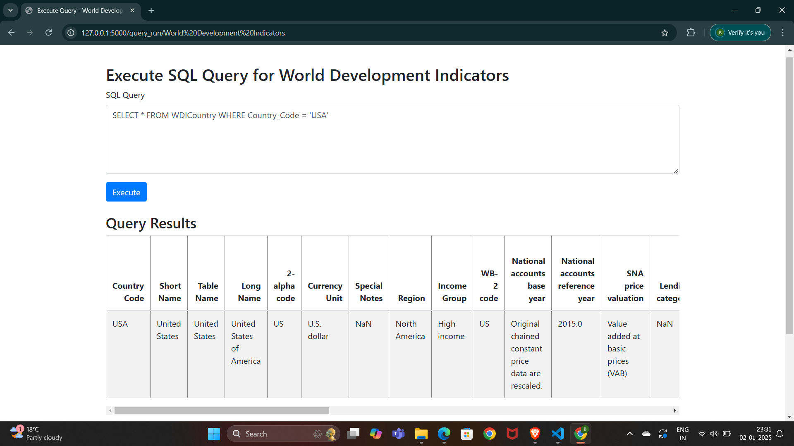

I'll create a README file for the distributed query processing system you've described. This README will provide an overview of the project, its components, setup instructions, and usage guidelines.

```markdown
# A Distributed Computation for Multi-Tenant Query Processing on large scale distributed data with Shared Resources 

## Overview

This project implements a distributed query processing system designed to handle large-scale data across multiple companies. It uses a sharding approach to partition data and allows for efficient querying while maintaining data isolation between different companies.

## Components

1. **Database Sharding (sharding.py)**
   - Handles the partitioning of large datasets into manageable shards.
   - Distributes data across multiple nodes for parallel processing.

2. **Schema Generation (schema.py)**
   - Generates metadata about the database schema.
   - Identifies relationships between tables.

3. **Query Execution (queryexecution.py)**
   - Implements the DistributedQueryEngine for executing SQL queries across sharded data.
   - Handles query parsing, optimization, and result aggregation.

4. **Web Interface (app.py)**
   - Flask-based web application for interacting with the system.
   - Provides endpoints for uploading data, sharding, and running queries.
home page

Upload Database page

sharding page

querying page

query result page


## Setup

1. Clone the repository:
```

git clone `<repository-url>`
cd `<project-directory>`

```plaintext

2. Install dependencies:
```

pip install -r requirements.txt

```plaintext

3. Set up the environment:
- Ensure you have Python 3.7+ installed.
- Configure any necessary environment variables (if applicable).

## Usage

1. Start the Flask application:
```

python app.py

```plaintext

2. Access the web interface at `http://localhost:5000`.

3. Upload a company's data:
- Use the "Upload Database" button on the homepage.
- Provide a company name and upload a ZIP file containing CSV data files.

4. Shard the uploaded data:
- Navigate to the company's page.
- Click the "Shard Data" button to partition the data.

5. Run queries:
- Once data is sharded, use the query interface on the company's page.
- Enter SQL queries and view results.

## API Endpoints

- `/`: Homepage
- `/upload`: Upload company data
- `/company/<company_name>`: Company-specific page
- `/shard/<company_name>`: Shard company data
- `/query_run/<company_name>`: Execute queries for a company

## File Structure

- `app.py`: Main Flask application
- `sharding.py`: Database sharding logic
- `schema.py`: Schema metadata generation
- `queryexecution.py`: Distributed query engine
- `templates/`: HTML templates for the web interface
- `uploads/`: Directory for uploaded and processed data

## Notes

- This system is designed for educational and demonstration purposes.
- Ensure proper security measures are implemented before using in a production environment.
- The current implementation uses CSV files and in-memory processing, which may not be suitable for extremely large datasets.

## Contributing

Contributions to improve the system are welcome. Please submit pull requests or open issues for any bugs or feature requests.

## License

[Specify your license here]
```

This README provides a comprehensive overview of your distributed query processing system. It covers the main components, setup instructions, usage guidelines, and important notes about the project. You may want to customize certain sections, such as the license information, based on your specific project requirements.