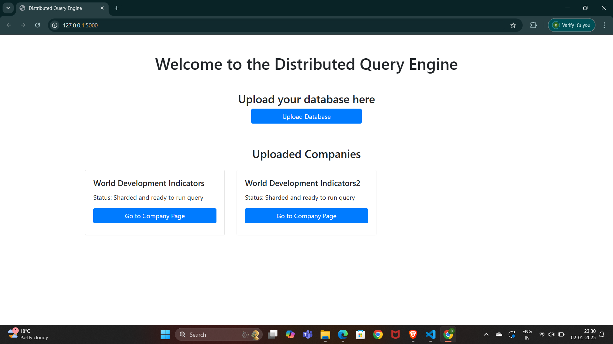
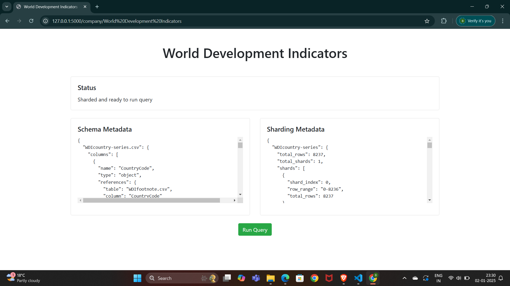

# A Distributed Computation for Multi-Tenant Query Processing on large scale distributed data with Shared Resources 

## Overview

This project implements a distributed query processing system designed to handle large-scale data across multiple companies. It uses a sharding approach to partition data and allows for efficient querying while maintaining data isolation between different companies.

  

## Components

1. **Database Sharding (sharding.py)**
   - Handles the partitioning of large datasets into manageable shards.
   - Distributes data across multiple nodes for parallel processing.

2. **Schema Generation (schema.py)**
   - Generates metadata about the database schema.
   - Identifies relationships between tables.

3. **Query Execution (queryexecution.py)**
   - Implements the DistributedQueryEngine for executing SQL queries across sharded data.
   - Handles query parsing, optimization, and result aggregation.

4. **Web Interface (app.py)**
   - Flask-based web application for interacting with the system.
   - Provides endpoints for uploading data, sharding, and running queries.
  
## IEEE paper  'https://github.com/kiran-kusuma/A-Distributed-Computation-on-shared-resouces/blob/main/B18.pdf'

## home page

## Upload Database page

## sharding page

## querying page

## query result page

## Setup

1. Clone the repository:

`git clone <repository-url>`
`cd <project-directory>`

2. Install dependencies:

`pip install -r requirements.txt`

3. Set up the environment:
- Ensure you have Python 3.7+ installed.
- Configure any necessary environment variables (if applicable).

4. Dataset sample download from below link:
- https://datacatalog.worldbank.org/search/dataset/0037712
## Usage

1. Start the Flask application:

`python app.py`

2. Access the web interface at `http://localhost:5000`.

3. Upload a company's data:
- Use the "Upload Database" button on the homepage.
- Provide a company name and upload a ZIP file containing CSV data files.

4. Shard the uploaded data:
- Navigate to the company's page.
- Click the "Shard Data" button to partition the data.

5. Run queries:
- Once data is sharded, use the query interface on the company's page.
- Enter SQL queries and view results.

## API Endpoints

- `/`: Homepage
- `/upload`: Upload company data
- `/company/<company_name>`: Company-specific page
- `/shard/<company_name>`: Shard company data
- `/query_run/<company_name>`: Execute queries for a company

## File Structure

- `app.py`: Main Flask application
- `sharding.py`: Database sharding logic
- `schema.py`: Schema metadata generation
- `queryexecution.py`: Distributed query engine
- `templates/`: HTML templates for the web interface
- `uploads/`: Directory for uploaded and processed data
